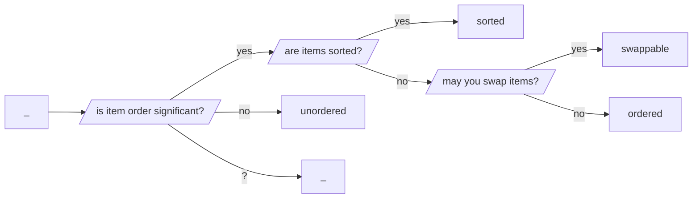
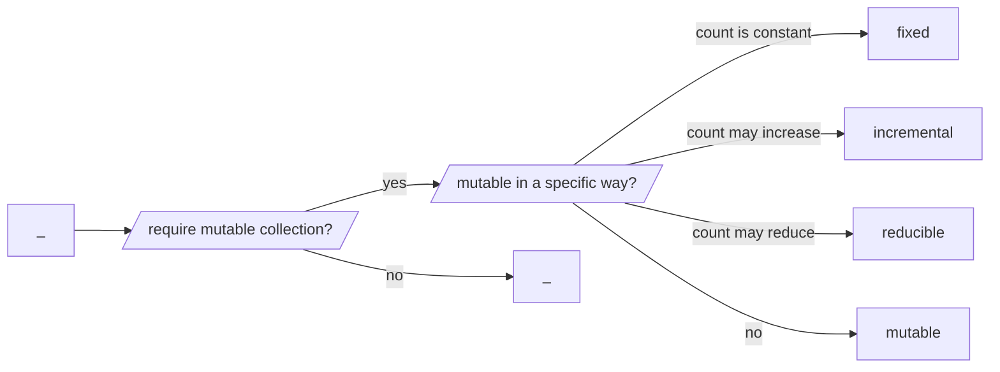

# aquarium-butterflyfish

Collection interfaces in C.

// set, list, deque, queue, stack, map

// _, unordered, ordered, swappable, sorted

// _, mutable, settable, incremental, reducible, settable_incremental, 
settable_reducible

| short code | description      |       data type        |
|:----------:|:-----------------|:----------------------:|
|     ni     | native integer   |     ``uintmax_t``      |
|     p      | pointer          |       ``void *``       |
|     i      | integer          | ``sea_turtle_integer`` |
|     s      | string           | ``sea_turtle_string``  |
|     r      | strong reference | ``triggerfish_strong`` |
|     w      | weak reference   |  ``triggerfish_weak``  |
