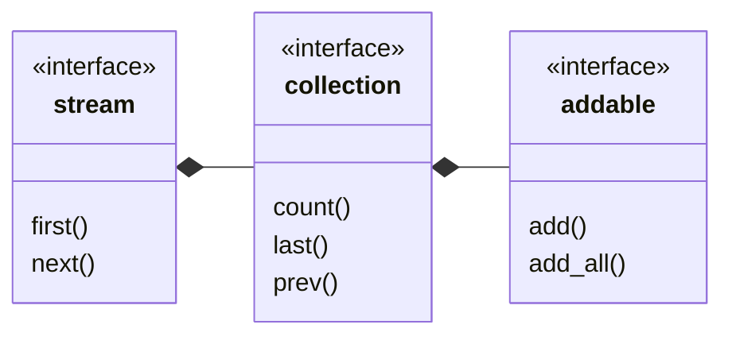

## addable

```mermaid
classDiagram
    direction LR
    class stream {
        first()
        next()
    }
    <<interface>> stream
    class collection {
        count()
        last()
        prev()
    }
    <<interface>> collection
    stream *-- collection
    class addable {
        add()
        add_all()
    }
    <<interface>> addable
    collection *-- addable
```

[addable](addable.md) _is a_ [collection](collection.md) where you may add 
items.
- add value
- add all values
