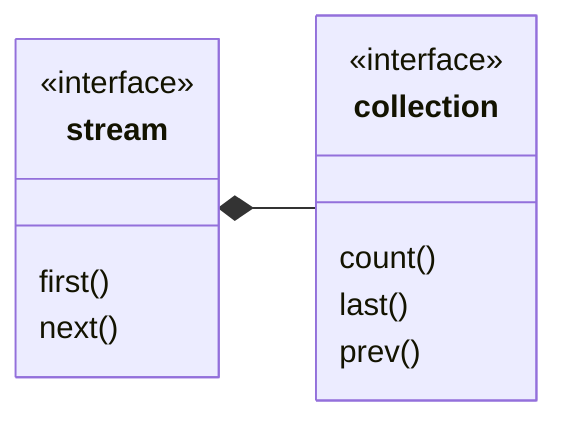

## collection

```mermaid
classDiagram
    direction LR
    class stream {
        first()
        next()
    }
    <<interface>> stream
    class collection {
        count()
        last()
        prev()
    }
    <<interface>> collection
    stream *-- collection
```

[collection](collection.md) _is a_ finite [stream](stream.md). 
- count of items
- get last item
- get previous item from given item
