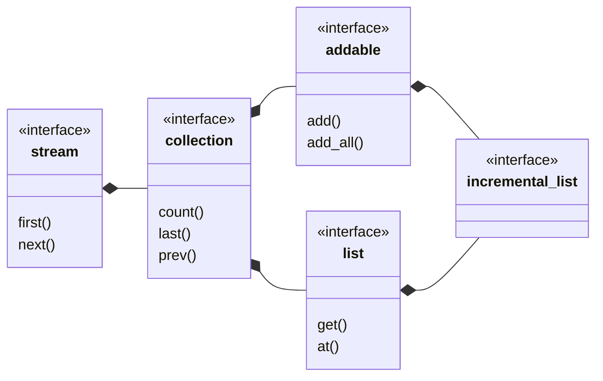

## incremental_list

```mermaid
classDiagram
    direction LR
    class stream {
        first()
        next()
    }
    <<interface>> stream
    class collection {
        count()
        last()
        prev()
    }
    <<interface>> collection
    stream *-- collection
    class list {
        get()
        at()
    }
    <<interface>> list
    collection *-- list
    class addable {
        add()
        add_all()
    }
    <<interface>> addable
    collection *-- addable
    class incremental_list 
    <<interface>> incremental_list
    addable *-- incremental_list
    list *-- incremental_list
```

[incremental_list](incremental_list.md) _is a_ [list](list.md) where may be added.
