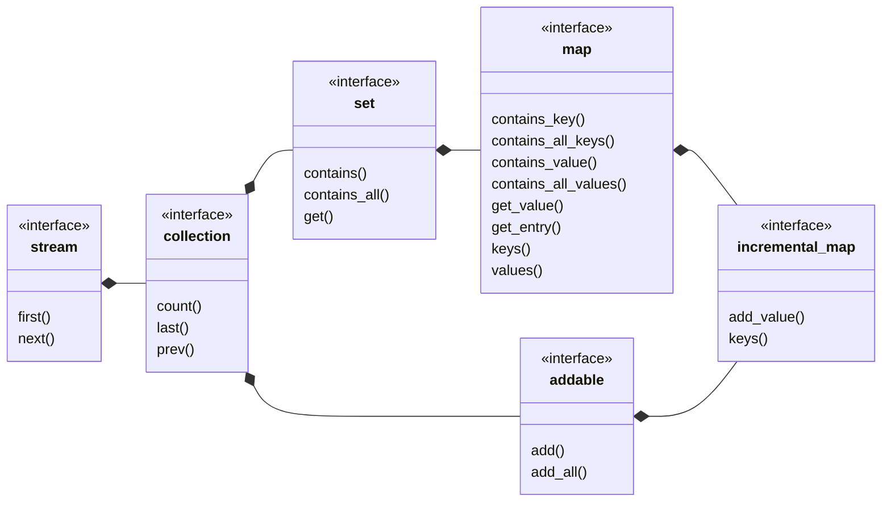

## incremental_map

```mermaid
classDiagram
    direction LR
    class stream {
        first()
        next()
    }
    <<interface>> stream
    class collection {
        count()
        last()
        prev()
    }
    <<interface>> collection
    stream *-- collection
    class set {
        contains()
        contains_all()
        get()
    }
    <<interface>> set
    collection *-- set
    class addable {
        add()
        add_all()      
    }
    <<interface>> addable
    collection *-- addable
    class map {
        contains_key()
        contains_all_keys()
        contains_value()
        contains_all_values()
        get_value()
        get_entry()
        keys()
        values()
    }
    <<interface>> map
    set *-- map
    class incremental_map {
        add_value()
        keys()
    }
    <<interface>> incremental_map
    map *-- incremental_map
    addable *-- incremental_map
```

[incremental_map](incremental_set.md) _is a_ [map](map.md) where the entry count may be increased.
- add value for key
- [incremental_set](incremental_set.md) view of keys
