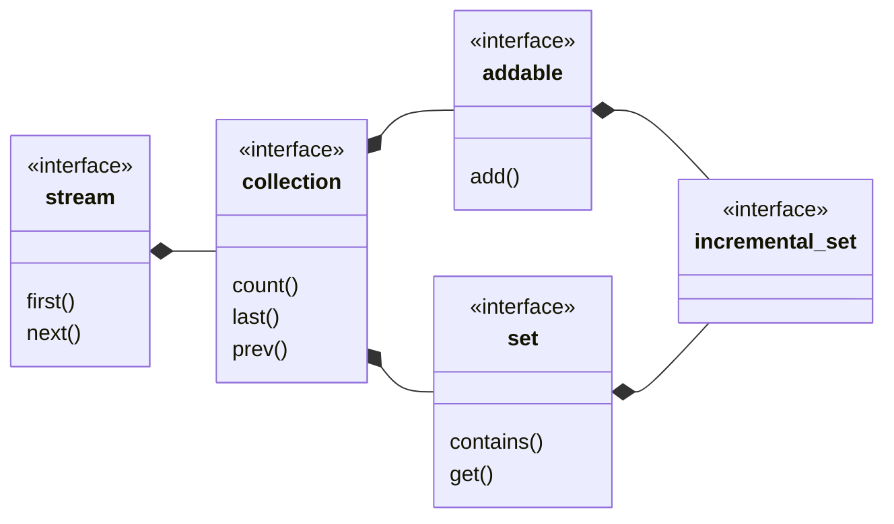

## incremental_set

```mermaid
classDiagram
    direction LR
    class stream {
        first()
        next()
    }
    <<interface>> stream
    class collection {
        count()
        last()
        prev()
    }
    <<interface>> collection
    stream *-- collection
    class set {
        contains()
        get()
    }
    <<interface>> set
    collection *-- set
    class addable {
        add()
    }
    <<interface>> addable
    collection *-- addable
    class incremental_set
    <<interface>> incremental_set
    addable *-- incremental_set
    set *-- incremental_set
```

[incremental_set](incremental_set.md) _is a_ [set](set.md) where the item count may be increased.
