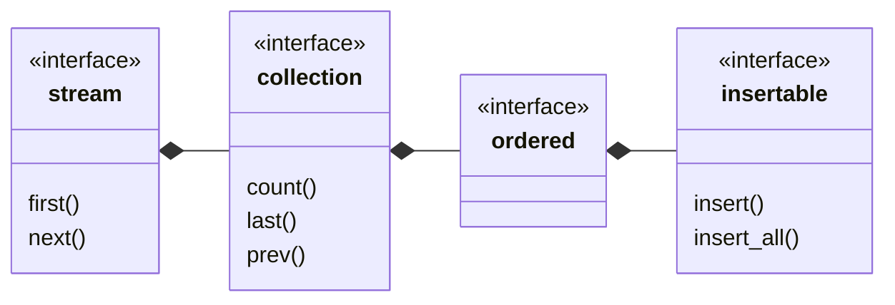

## insertable

```mermaid
classDiagram
    direction LR
    class stream {
        first()
        next()
    }
    <<interface>> stream
    class collection {
        count()
        last()
        prev()
    }
    <<interface>> collection
    stream *-- collection
    class ordered 
    <<interface>> ordered
    collection *-- ordered
    class insertable {
        insert()
        insert_all()
    }
    <<interface>> insertable
    ordered *-- insertable
```

[insertable](insertable.md) _is an_ [ordered](ordered.md) where you may insert items.
- insert value
- insert all values
