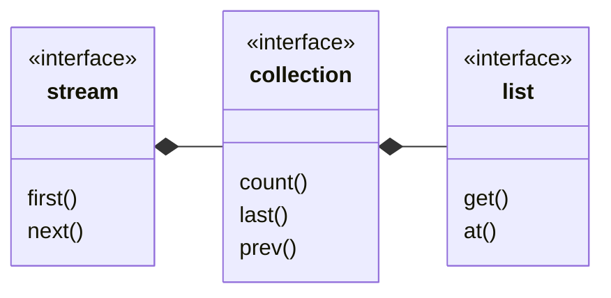

## list

```mermaid
classDiagram
    direction LR
    class stream {
        first()
        next()
    }
    <<interface>> stream
    class collection {
        count()
        last()
        prev()
    }
    <<interface>> collection
    stream *-- collection
    class list {
        get()
        at()
    }
    <<interface>> list
    collection *-- list
```

[list](list.md) _is a_ [collection](collection.md) where items are looked up by index.
- get item at index
- get index of an item
