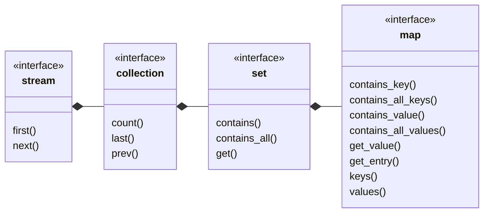

## map

[map](map.md) _is a_ [set](set.md) where values are looked up by unique key.
- contains key
- contains value
- get value for key
- [set](set.md) view of keys
- [ordered_list](ordered_list.md) view of values
