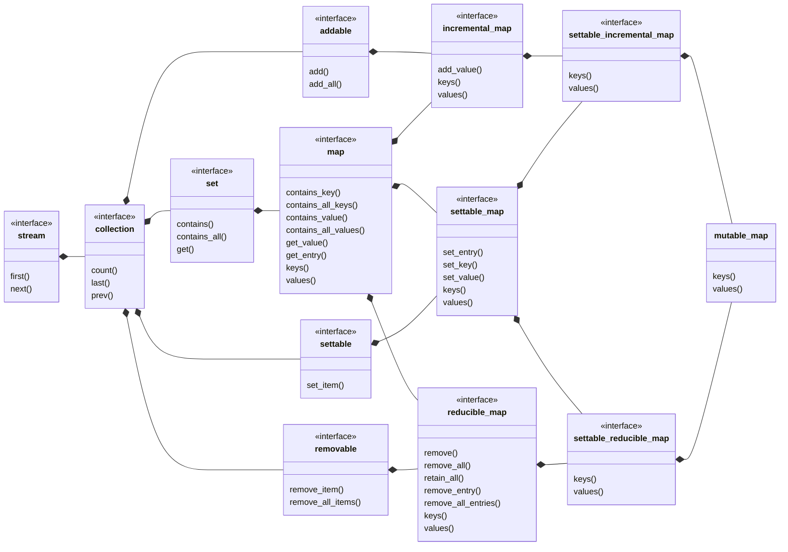

## mutable_map

[mutable_map](mutable_map.md) _is a_ [map](map.md) whose contents may change.
- [mutable_set](settable_incremental_set.md) view of keys
- [ordered_settable_reducible_list](ordered_settable_list.md) view of values
