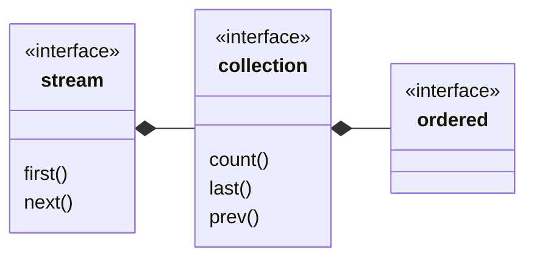

## ordered

```mermaid
classDiagram
    direction LR
    class stream {
        first()
        next()
    }
    <<interface>> stream
    class collection {
        count()
        last()
        prev()
    }
    <<interface>> collection
    stream *-- collection
    class ordered 
    <<interface>> ordered
    collection *-- ordered
```

[ordered](ordered.md) is a [collection](collection.md) where item order is significant.
