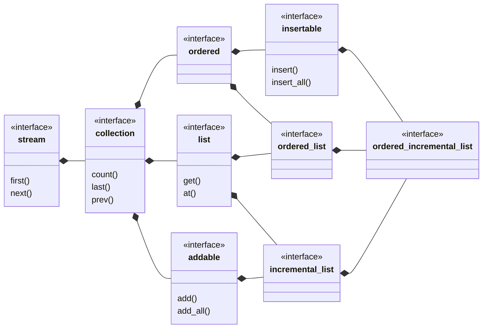

## ordered_incremental_list

```mermaid
classDiagram
    direction LR
    class stream {
        first()
        next()
    }
    <<interface>> stream
    class collection {
        count()
        last()
        prev()
    }
    <<interface>> collection
    stream *-- collection
    class ordered
    <<interface>> ordered
    collection *-- ordered
    class insertable {
        insert()
        insert_all()
    }
    <<interface>> insertable
    ordered *-- insertable
    class list {
        get()
        at()
    }
    <<interface>> list
    collection *-- list
    class ordered_list
    <<interface>> ordered_list
    ordered *-- ordered_list
    list *-- ordered_list
    class addable {
        add()
        add_all()
    }
    <<interface>> addable
    collection *-- addable
    class incremental_list
    <<interface>> incremental_list
    addable *-- incremental_list
    list *-- incremental_list
    class ordered_incremental_list
    <<interface>> ordered_incremental_list
    insertable *-- ordered_incremental_list
    ordered_list *-- ordered_incremental_list
    incremental_list *-- ordered_incremental_list
```

[ordered_incremental_list](ordered_incremental_list.md) _is an_ 
[incremental_list](incremental_list.md) where the item order is significant.
