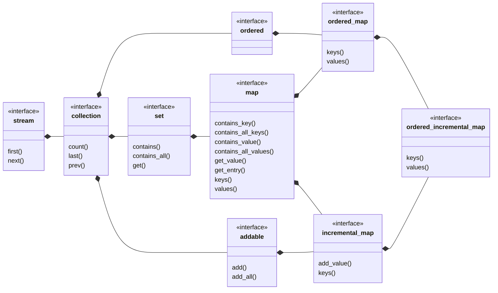

## ordered_incremental_map

[ordered_incremental_map](ordered_incremental_map.md) _is an_ [incremental_map](incremental_map.md) where the entry order is significant.
- [ordered_incremental_set](ordered_incremental_set.md) view of keys
- [ordered_list](ordered_list.md) view of values
