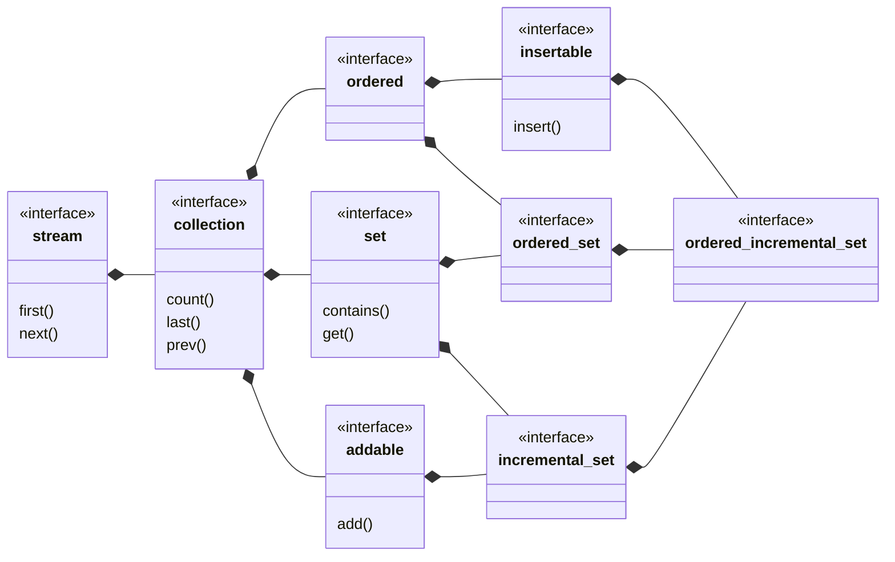

## ordered_incremental_set

```mermaid
classDiagram
    direction LR
    class stream {
        first()
        next()
    }
    <<interface>> stream
    class collection {
        count()
        last()
        prev()
    }
    <<interface>> collection
    stream *-- collection
    class ordered
    <<interface>> ordered
    collection *-- ordered
    class insertable {
        insert()
    }
    <<interface>> insertable
    ordered *-- insertable
    class set {
        contains()
        get()
    }
    <<interface>> set
    collection *-- set
    class addable {
        add()
    }
    <<interface>> addable
    collection *-- addable
    class incremental_set
    <<interface>> incremental_set
    set *-- incremental_set
    addable *-- incremental_set
    class ordered_set
    <<interface>> ordered_set
    ordered *-- ordered_set
    set *-- ordered_set
    class ordered_incremental_set
    <<interface>> ordered_incremental_set
    insertable *-- ordered_incremental_set
    ordered_set *-- ordered_incremental_set
    incremental_set *-- ordered_incremental_set
```

[ordered_incremental_set](ordered_incremental_set.md) _is an_ 
[incremental_set](incremental_set.md) where the item order is significant.
