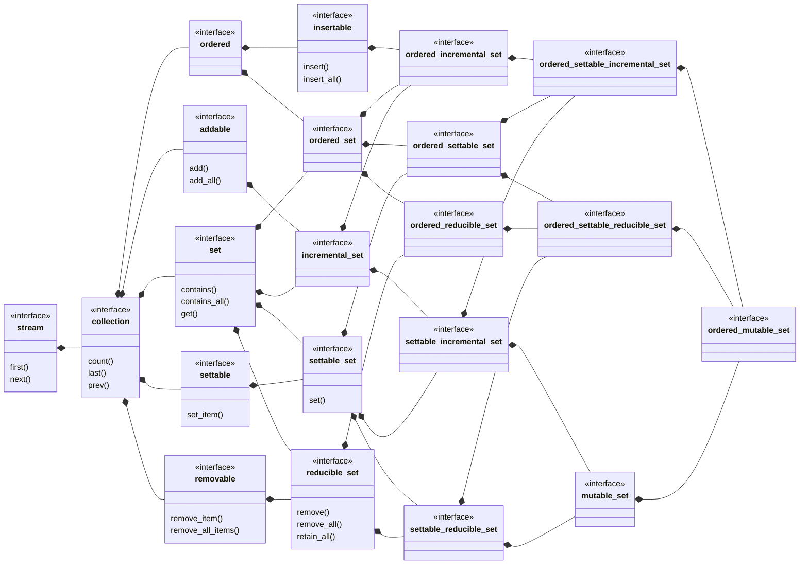

## ordered_mutable_set

```mermaid
classDiagram
    direction LR
    class stream {
        first()
        next()
    }
    <<interface>> stream
    class collection {
        count()
        last()
        prev()
    }
    <<interface>> collection
    stream *-- collection
    class ordered
    <<interface>> ordered
    collection *-- ordered
    class insertable {
        insert()
        insert_all()
    }
    <<interface>> insertable
    ordered *-- insertable
    class settable {
        set_item()
    }
    <<interface>> settable
    collection *-- settable
    class addable {
        add()
        add_all()
    }
    <<interface>> addable
    collection *-- addable
    class removable {
        remove_item()
        remove_all_items()
    }
    <<interface>> removable
    collection *-- removable
    class set {
        contains()
        contains_all()
        get()
    }
    <<interface>> set
    collection *-- set
    class ordered_set
    <<interface>> ordered_set
    ordered *-- ordered_set
    set *-- ordered_set
    class settable_set {
        set()
    }
    <<interface>> settable_set
    set *-- settable_set
    settable *-- settable_set
    class ordered_settable_set
    <<interface>> ordered_settable_set
    ordered_set *-- ordered_settable_set
    settable_set *-- ordered_settable_set
    class incremental_set
    <<interface>> incremental_set
    addable *-- incremental_set
    set *-- incremental_set
    class ordered_incremental_set
    <<interface>> ordered_incremental_set
    insertable *-- ordered_incremental_set
    ordered_set *-- ordered_incremental_set
    incremental_set *-- ordered_incremental_set
    class reducible_set {
        remove()
        remove_all()
        retain_all()
    }
    <<interface>> reducible_set
    set *-- reducible_set
    removable *-- reducible_set
    class ordered_reducible_set
    <<interface>> ordered_reducible_set
    ordered_set *-- ordered_reducible_set
    reducible_set *-- ordered_reducible_set
    class settable_incremental_set
    <<interface>> settable_incremental_set
    incremental_set *-- settable_incremental_set
    settable_set *-- settable_incremental_set
    class settable_reducible_set
    <<interface>> settable_reducible_set
    settable_set *-- settable_reducible_set
    reducible_set *-- settable_reducible_set
    class mutable_set
    <<interface>> mutable_set
    settable_incremental_set *-- mutable_set
    settable_reducible_set *-- mutable_set
    class ordered_settable_incremental_set
    <<interface>> ordered_settable_incremental_set
    ordered_incremental_set *-- ordered_settable_incremental_set
    ordered_settable_set *-- ordered_settable_incremental_set
    settable_incremental_set *-- ordered_settable_incremental_set
    class ordered_settable_reducible_set
    <<interface>> ordered_settable_reducible_set
    ordered_settable_set *-- ordered_settable_reducible_set
    ordered_reducible_set *-- ordered_settable_reducible_set
    settable_reducible_set *-- ordered_settable_reducible_set
    class ordered_mutable_set
    <<interface>> ordered_mutable_set
    ordered_settable_incremental_set *-- ordered_mutable_set
    ordered_settable_reducible_set *-- ordered_mutable_set
    mutable_set *-- ordered_mutable_set
```

[ordered_mutable_set](ordered_mutable_set.md) _is an_ 
[ordered_set](ordered_set.md) whose contents may change.
