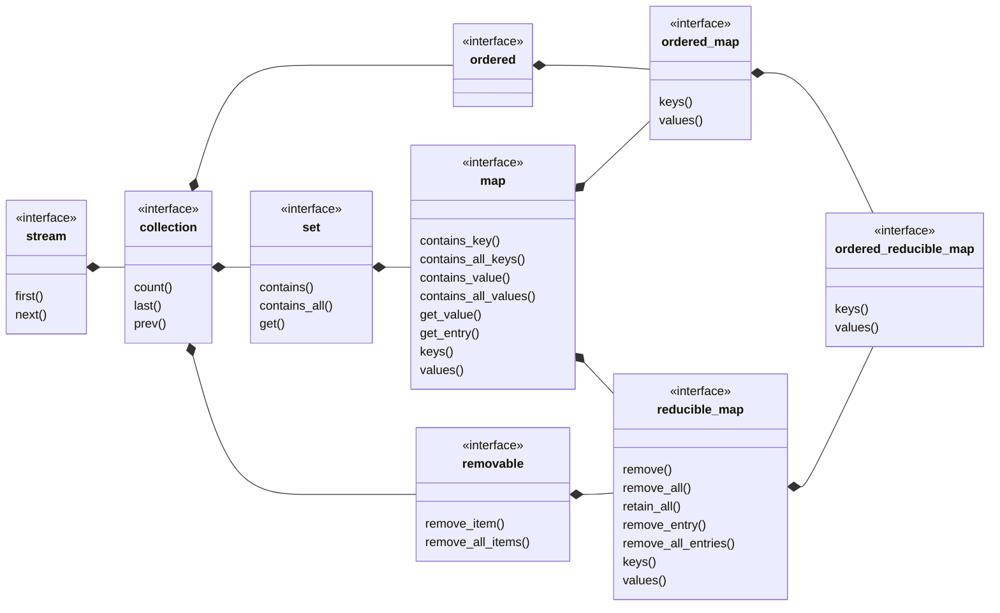

## ordered_reducible_map

[ordered_reducible_map](ordered_reducible_map.md) _is a_ 
[reducible_map](reducible_map.md) where the item order is significant.
- [ordered_reducible_set](ordered_reducible_set.md) view of keys
- [ordered_reducible_list](ordered_reducible_list.md) view of values
