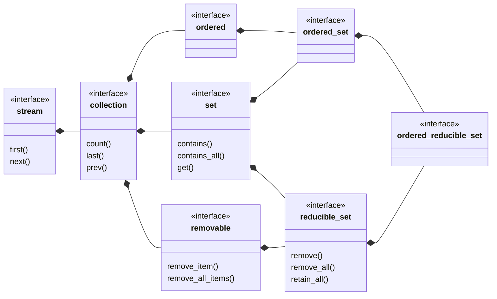

## ordered_reducible_set

```mermaid
classDiagram
    direction LR
    class stream {
        first()
        next()
    }
    <<interface>> stream
    class collection {
        count()
        last()
        prev()
    }
    <<interface>> collection
    stream *-- collection
    class ordered
    <<interface>> ordered
    collection *-- ordered
    class set {
        contains()
        contains_all()
        get()
    }
    <<interface>> set
    collection *-- set
    class removable {
        remove_item()
        remove_all_items()
    }
    <<interface>> removable
    collection *-- removable
    class reducible_set {
        remove()
        remove_all()
        retain_all()
    }
    <<interface>> reducible_set
    set *-- reducible_set
    removable *-- reducible_set    
    class ordered_set
    <<interface>> ordered_set
    ordered *-- ordered_set
    set *-- ordered_set
    class ordered_reducible_set
    <<interface>> ordered_reducible_set
    ordered_set *-- ordered_reducible_set
    reducible_set *-- ordered_reducible_set
```

[ordered_reducible_set](ordered_reducible_set.md) _is a_ [reducible_set](reducible_set.md) where the item order 
is significant.
