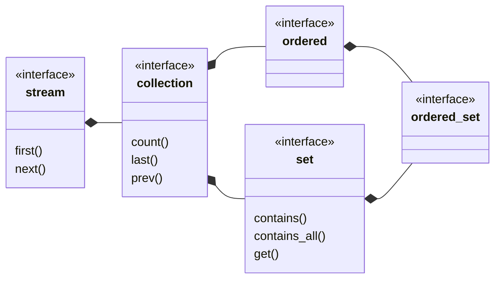

## ordered_set

```mermaid
classDiagram
    direction LR
    class stream {
        first()
        next()
    }
    <<interface>> stream
    class collection {
        count()
        last()
        prev()
    }
    <<interface>> collection
    stream *-- collection
    class ordered
    <<interface>> ordered
    collection *-- ordered
    class set {
        contains()
        contains_all()
        get()
    }
    <<interface>> set
    collection *-- set
    class ordered_set 
    <<interface>> ordered_set
    ordered *-- ordered_set
    set *-- ordered_set
```

[ordered_set](ordered_set.md) _is a_ [set](set.md) where the item order is significant.
