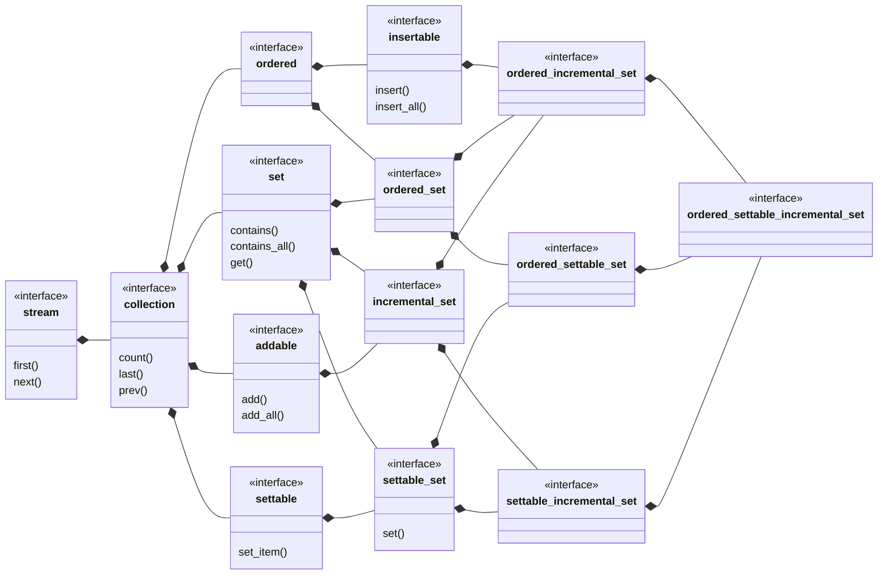

## ordered_settable_incremental_set

[ordered_settable_incremental_set](ordered_settable_incremental_set.md) _is a_ 
[settable_incremental_set](settable_incremental_set.md) where the item order is significant.
