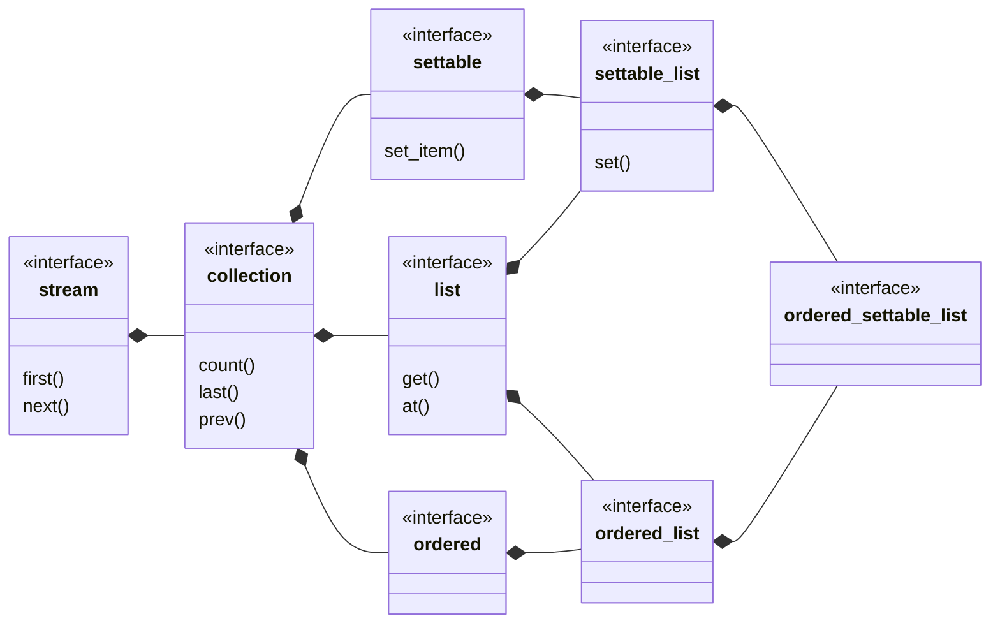

## ordered_settable_list

```mermaid
classDiagram
    direction LR
    class stream {
        first()
        next()
    }
    <<interface>> stream
    class collection {
        count()
        last()
        prev()
    }
    <<interface>> collection
    stream *-- collection
    class ordered
    <<interface>> ordered
    collection *-- ordered
    class list {
        get()
        at()
    }
    <<interface>> list
    collection *-- list
    class settable {
        set_item()
    }
    <<interface>> settable
    collection *-- settable
    class settable_list {
        set()
    }
    <<interface>> settable_list
    settable *-- settable_list
    list *-- settable_list
    class ordered_list
    <<interface>> ordered_list
    list *-- ordered_list
    ordered *-- ordered_list
    class ordered_settable_list
    <<interface>> ordered_settable_list
    settable_list *-- ordered_settable_list
    ordered_list *-- ordered_settable_list
```

[ordered_settable_list](ordered_settable_list.md) _is an_ [ordered_list](ordered_list.md) 
where the items are settable.
