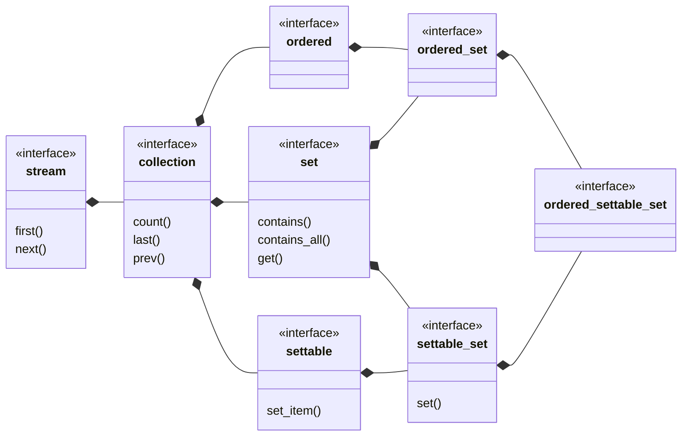

## ordered_settable_set

```mermaid
classDiagram
    direction LR
    class stream {
        first()
        next()
    }
    <<interface>> stream
    class collection {
        count()
        last()
        prev()
    }
    <<interface>> collection
    stream *-- collection
    class ordered
    <<interface>> ordered
    collection *-- ordered
    class settable {
        set_item()
    }
    <<interface>> settable
    collection *-- settable
    class set {
        contains()
        contains_all()
        get()
    }
    <<interface>> set
    collection *-- set
    class settable_set {
        set()
    }
    <<interface>> settable_set
    set *-- settable_set
    settable *-- settable_set
    class ordered_set
    <<interface>> ordered_set
    ordered *-- ordered_set
    set *-- ordered_set
    class ordered_settable_set 
    <<interface>> ordered_settable_set
    ordered_set *-- ordered_settable_set
    settable_set *-- ordered_settable_set
```

[ordered_settable_set](ordered_settable_set.md) _is a_ [settable_set](settable_set.md) 
where the item order is significant.
