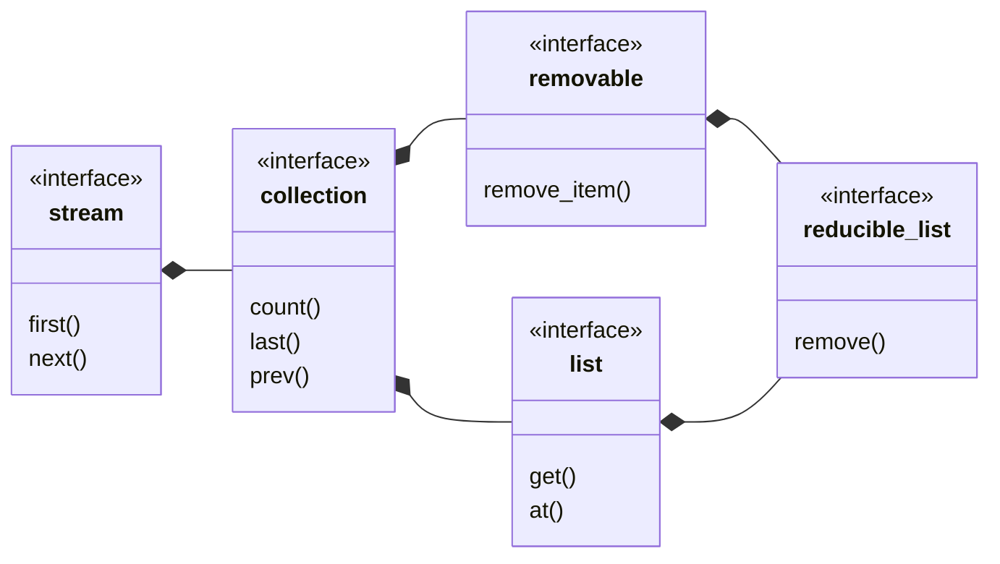

## reducible_list

```mermaid
classDiagram
    direction LR
    class stream {
        first()
        next()
    }
    <<interface>> stream
    class collection {
        count()
        last()
        prev()
    }
    <<interface>> collection
    stream *-- collection
    class list {
        get()
        at()
    }
    <<interface>> list
    collection *-- list
    class removable {
        remove_item()
    }
    <<interface>> removable
    collection *-- removable
    class reducible_list {
        remove()
    }
    <<interface>> reducible_list
    removable *-- reducible_list
    list *-- reducible_list
```

[reducible_list](reducible_list.md) _is a_ [list](list.md) where the item 
count may be reduced. 
- remove
