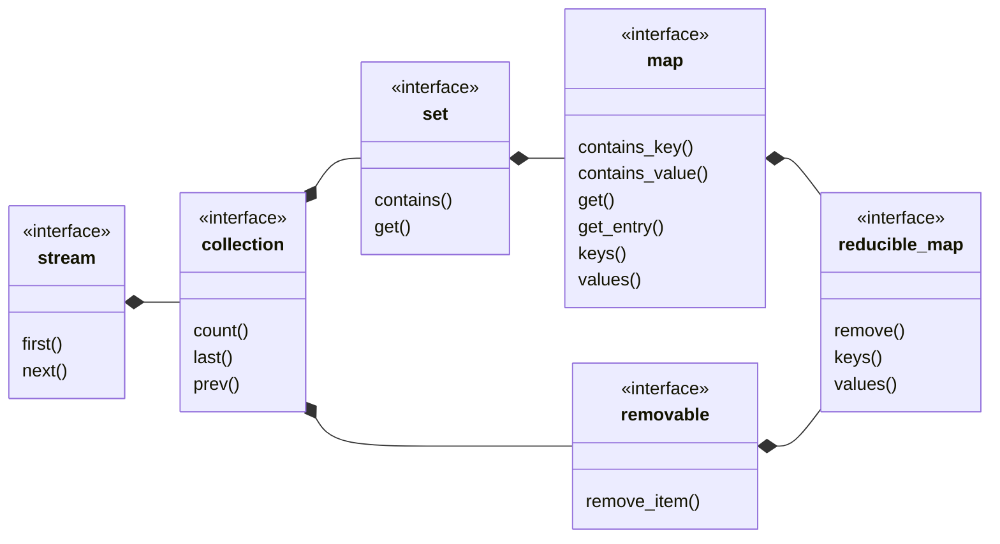

## reducible_map

[reducible_map](reducible_map.md) _is a_ [map](map.md) where the entry count may be reduced.
- remove
- [reducible_set](reducible_set.md) view of keys
- [ordered_reducible_list](ordered_reducible_list.md) view of values
