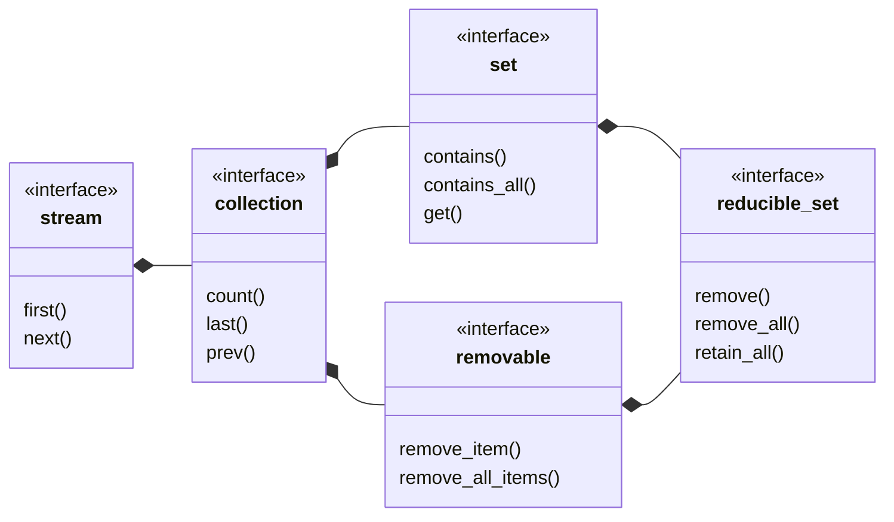

## reducible_set

```mermaid
classDiagram
    direction LR
    class stream {
        first()
        next()
    }
    <<interface>> stream
    class collection {
        count()
        last()
        prev()
    }
    <<interface>> collection
    stream *-- collection
    class set {
        contains()
        contains_all()
        get()
    }
    <<interface>> set
    collection *-- set
    class removable {
        remove_item()
        remove_all_items()
    }
    <<interface>> removable
    collection *-- removable
    class reducible_set {
        remove()
        remove_all()
        retain_all()
    }
    <<interface>> reducible_set
    set *-- reducible_set
    removable *-- reducible_set
```

[reducible_set](reducible_set.md) _is a_ [set](set.md) where the item count may be reduced.
- remove value
- remove all values
- retain all values
