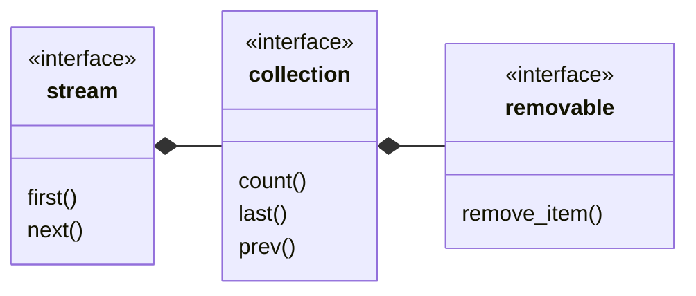

## removable

```mermaid
classDiagram
    direction LR
    class stream {
        first()
        next()
    }
    <<interface>> stream
    class collection {
        count()
        last()
        prev()
    }
    <<interface>> collection
    stream *-- collection
    class removable {
        remove_item()
    }
    <<interface>> removable
    collection *-- removable
```

[reducible](removable.md) _is a_ [collection](collection.md) where you may remove items.
- remove item
