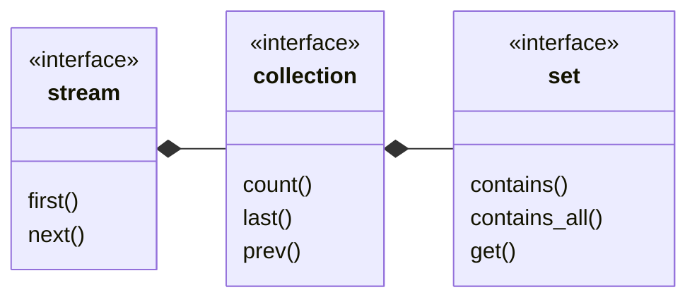

## set

```mermaid
classDiagram
    direction LR
    class stream {
        first()
        next()
    }
    <<interface>> stream
    class collection {
        count()
        last()
        prev()
    }
    <<interface>> collection
    stream *-- collection
    class set {
        contains()
        contains_all()
        get()
    }
    <<interface>> set
    collection *-- set
```

[set](set.md) _is a_ [collection](collection.md) where unique items are looked up by value.
- contains value
- contains all values
- get item by value
