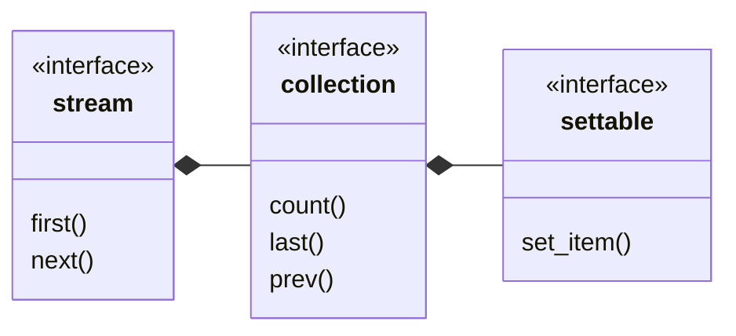

## settable

```mermaid
classDiagram
    direction LR
    class stream {
        first()
        next()
    }
    <<interface>> stream
    class collection {
        count()
        last()
        prev()
    }
    <<interface>> collection
    stream *-- collection
    class settable {
        set_item()
    }
    <<interface>> settable
    collection *-- settable
```

[settable](settable.md) is a [collection](collection.md) where you may set the value of an item.
- set item's value
