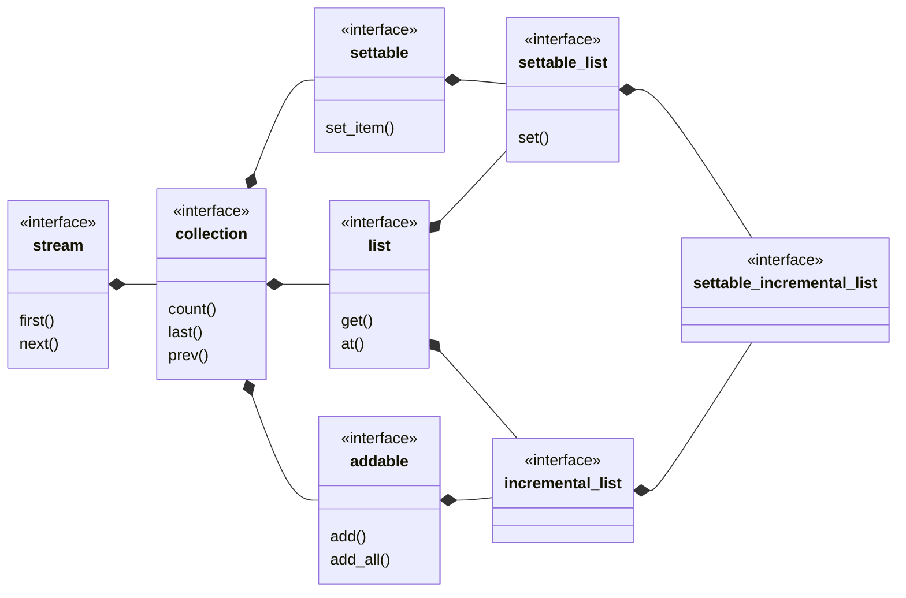

## settable_incremental_list

```mermaid
classDiagram
    direction LR
    class stream {
        first()
        next()
    }
    <<interface>> stream
    class collection {
        count()
        last()
        prev()
    }
    <<interface>> collection
    stream *-- collection
    class list {
        get()
        at()
    }
    class settable {
        set_item()
    }
    <<interface>> settable
    collection *-- settable
    <<interface>> list
    collection *-- list
    class settable_list {
        set()
    }
    <<interface>> settable_list
    settable *-- settable_list
    list *-- settable_list
    class addable {
        add()
        add_all()
    }
    <<interface>> addable
    collection *-- addable
    class incremental_list
    <<interface>> incremental_list
    addable *-- incremental_list
    list *-- incremental_list
    class settable_incremental_list
    <<interface>> settable_incremental_list
    settable_list *-- settable_incremental_list
    incremental_list *-- settable_incremental_list
```

[settable_incremental_list](settable_incremental_list.md) _is a_ [settable_list](settable_list.md) where the item count may be increased.
