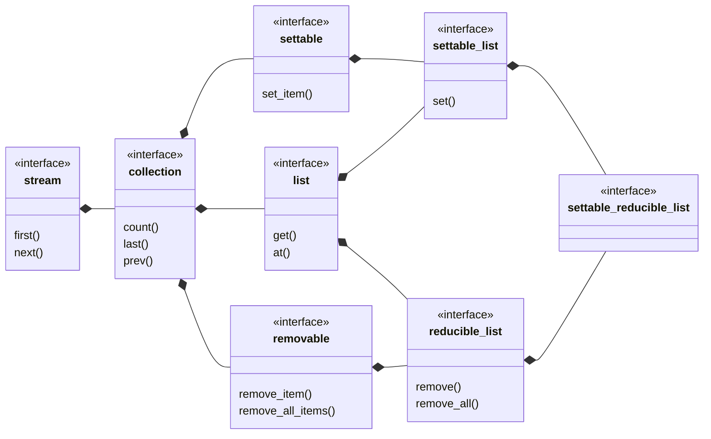

## settable_reducible_list

```mermaid
classDiagram
    direction LR
    class stream {
        first()
        next()
    }
    <<interface>> stream
    class collection {
        count()
        last()
        prev()
    }
    <<interface>> collection
    stream *-- collection
    class list {
        get()
        at()
    }
    class settable {
        set_item()
    }
    <<interface>> settable
    collection *-- settable
    <<interface>> list
    collection *-- list
    class settable_list {
        set()
    }
    <<interface>> settable_list
    settable *-- settable_list
    list *-- settable_list
    class removable {
        remove_item()
        remove_all_items()
    }
    <<interface>> removable
    collection *-- removable
    class reducible_list {
        remove()
        remove_all()
    }
    <<interface>> reducible_list
    removable *-- reducible_list
    list *-- reducible_list
    class settable_reducible_list
    <<interface>> settable_reducible_list
    settable_list *-- settable_reducible_list
    reducible_list *-- settable_reducible_list
```

[settable_reducible_list](settable_reducible_list.md) _is a_ [settable_list](settable_list.md) 
where the item count may be reduced. 
