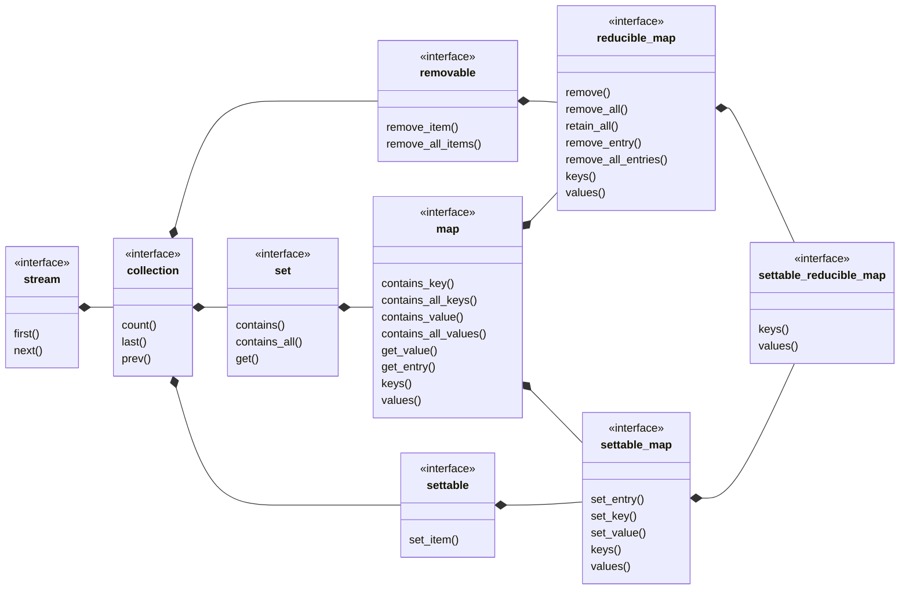

## settable_reducible_map

[settable_reducible_map](settable_reducible_map.md) _is a_ [settable_map](settable_map.md) 
where the entry count may be reduced.
- [settable_reducible_set](settable_set.md) view of keys
- [settable_reducible_list](settable_list.md) view of values
