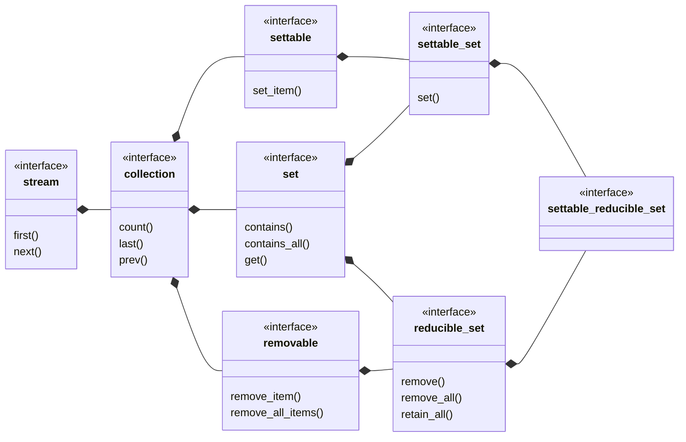

## settable_reducible_set

```mermaid
classDiagram
direction LR
    direction LR
    class stream {
        first()
        next()
    }
    <<interface>> stream
    class collection {
        count()
        last()
        prev()
    }
    <<interface>> collection
    stream *-- collection
    class settable {
        set_item()
    }
    <<interface>> settable
    collection *-- settable
    class set {
        contains()
        contains_all()
        get()
    }
    <<interface>> set
    collection *-- set
    class settable_set {
        set()
    }
    <<interface>> settable_set
    settable *-- settable_set
    set *-- settable_set
    class removable {
        remove_item()
        remove_all_items()
    }
    <<interface>> removable
    collection *-- removable
    class reducible_set {
        remove()
        remove_all()
        retain_all()
    }
    <<interface>> reducible_set
    set *-- reducible_set
    removable *-- reducible_set
    class settable_reducible_set
    <<interface>> settable_reducible_set
    settable_set *-- settable_reducible_set
    reducible_set *-- settable_reducible_set
```

[settable_reducible_set](settable_reducible_set.md) _is a_ [settable_set](settable_set.md) where the item count may also be reduced.
