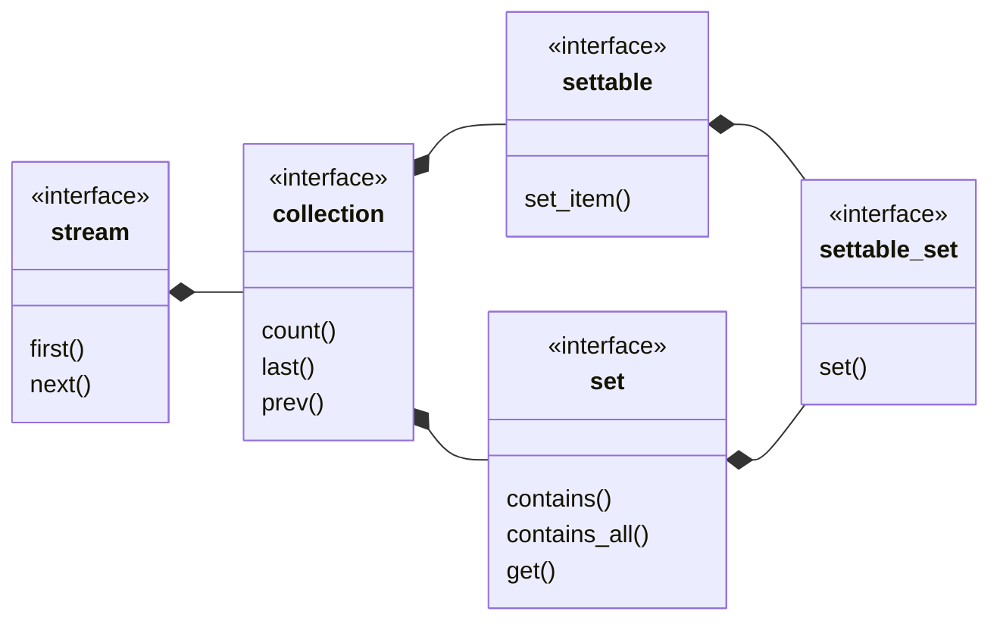

## settable_set

```mermaid
classDiagram
    direction LR
    class stream {
        first()
        next()
    }
    <<interface>> stream
    class collection {
        count()
        last()
        prev()
    }
    <<interface>> collection
    stream *-- collection
    class settable {
        set_item()
    }
    <<interface>> settable
    collection *-- settable
    class set {
        contains()
        contains_all()
        get()
    }
    <<interface>> set
    collection *-- set
    class settable_set {
        set()
    } 
    <<interface>> settable_set
    settable *-- settable_set
    set *-- settable_set
```

[settable_set](settable_set.md) _is a_ [set](set.md) where the items are settable.
- set value
