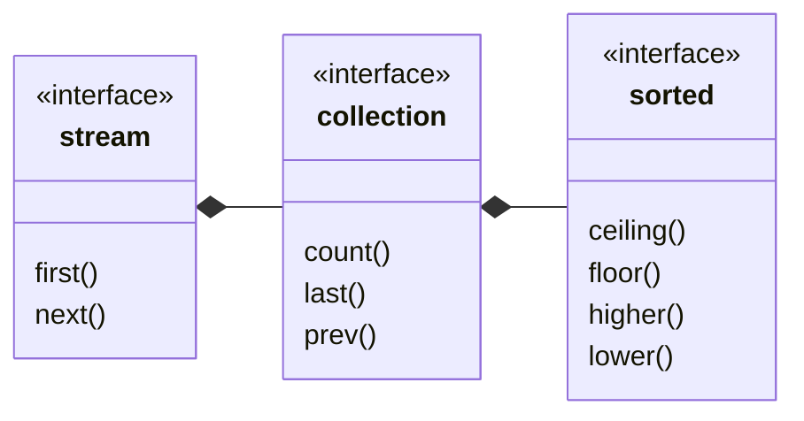

## sorted

```mermaid
classDiagram
    direction LR
    class stream {
        first()
        next()
    }
    <<interface>> stream
    class collection {
        count()
        last()
        prev()
    }
    <<interface>> collection
    stream *-- collection
    class sorted {
        ceiling()
        floor()
        higher()
        lower()
    }
    <<interface>> sorted
    collection *-- sorted
```

[sorted](sorted.md) _is a_ [collection](collection.md) where the items are in sorted order.
- ceiling
- floor
- higher
- lower
