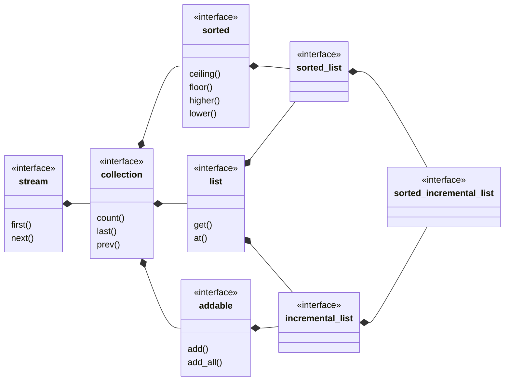

## sorted_incremental_list

```mermaid
classDiagram
    direction LR
    class stream {
        first()
        next()
    }
    <<interface>> stream
    class collection {
        count()
        last()
        prev()
    }
    <<interface>> collection
    stream *-- collection
    class sorted {
        ceiling()
        floor()
        higher()
        lower()
    }
    <<interface>> sorted
    collection *-- sorted
    class list {
        get()
        at()
    }
    <<interface>> list
    collection *-- list
    class sorted_list
    <<interface>> sorted_list
    sorted *-- sorted_list
    list *-- sorted_list
    class addable {
        add()
        add_all()
    }
    <<interface>> addable
    collection *-- addable
    class incremental_list
    <<interface>> incremental_list
    list *-- incremental_list
    addable *-- incremental_list
    class sorted_incremental_list
    <<interface>> sorted_incremental_list
    sorted_list *-- sorted_incremental_list
    incremental_list *-- sorted_incremental_list
```

[sorted_incremental_list](sorted_incremental_list.md) _is an_ 
[incremental_list](incremental_list.md) where the items are sorted.
