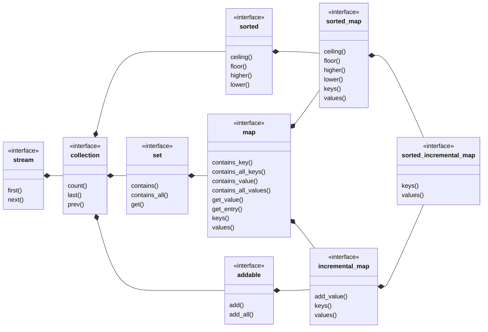

## sorted_incremental_map

[sorted_incremental_map](sorted_incremental_map.md) _is an_ [incremental_map](incremental_map.md) where the keys are sorted.
- [sorted_incremental_set](sorted_incremental_set.md) view of keys
- [sorted_list](sorted_list.md) view of values
