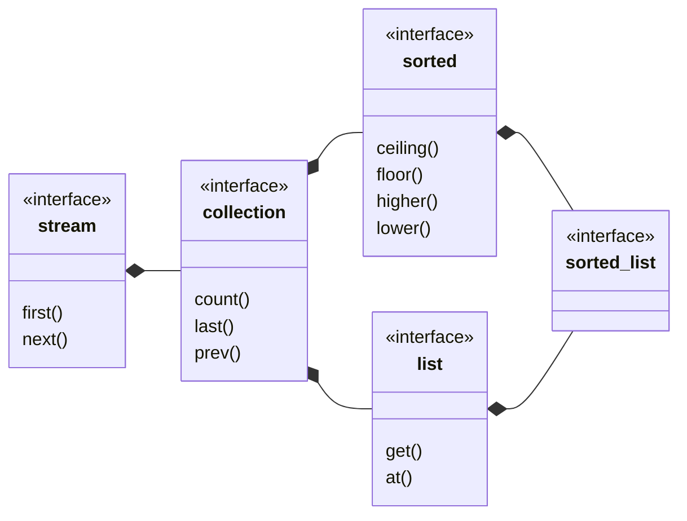

## sorted_list

```mermaid
classDiagram
    direction LR
    class stream {
        first()
        next()
    }
    <<interface>> stream
    class collection {
        count()
        last()
        prev()
    }
    <<interface>> collection
    stream *-- collection
    class sorted {
        ceiling()
        floor()
        higher()
        lower()
    }
    <<interface>> sorted
    collection *-- sorted
    class list {
        get()
        at()
    }
    <<interface>> list
    collection *-- list
    class sorted_list
    <<interface>> sorted_list
    sorted *-- sorted_list
    list *-- sorted_list
```

[sorted_list](sorted_list.md) _is a_ [list](list.md) where the items are in sorted order.
