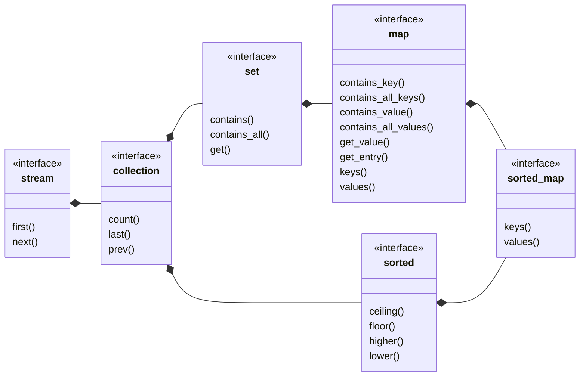

## sorted_map

```mermaid
classDiagram
    direction LR
    class stream {
        first()
        next()
    }
    <<interface>> stream
    class collection {
        count()
        last()
        prev()
    }
    <<interface>> collection
    stream *-- collection
    class sorted {
        ceiling()
        floor()
        higher()
        lower()
    }
    <<interface>> sorted
    collection *-- sorted
    class set {
        contains()
        contains_all()
        get()
    }
    <<interface>> set
    collection *-- set
    class map {
        contains_key()
        contains_all_keys()
        contains_value()
        contains_all_values()
        get_value()
        get_entry()
        keys()
        values()
    }
    <<interface>> map
    set *-- map
    class sorted_map {
        keys()
        values()
    }
    <<interface>> sorted_map
    map *-- sorted_map
    sorted *-- sorted_map
```

[sorted_map](sorted_map.md) _is a_ [map](map.md) where the items are in sorted order.
- [sorted_set](sorted_set.md) view of keys
- [sorted_list](sorted_list.md) view of values
