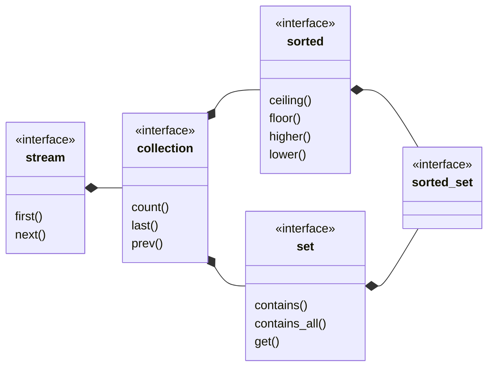

## sorted_set

```mermaid
classDiagram
    direction LR
    class stream {
        first()
        next()
    }
    <<interface>> stream
    class collection {
        count()
        last()
        prev()
    }
    <<interface>> collection
    stream *-- collection
    class sorted {
        ceiling()
        floor()
        higher()
        lower()
    }
    <<interface>> sorted
    collection *-- sorted
    class set {
        contains()
        contains_all()
        get()
    }
    <<interface>> set
    collection *-- set
    class sorted_set 
    <<interface>> sorted_set
    sorted *-- sorted_set
    set *-- sorted_set
```

[sorted_set](sorted_set.md) _is a_ [set](set.md) where the items are sorted.
