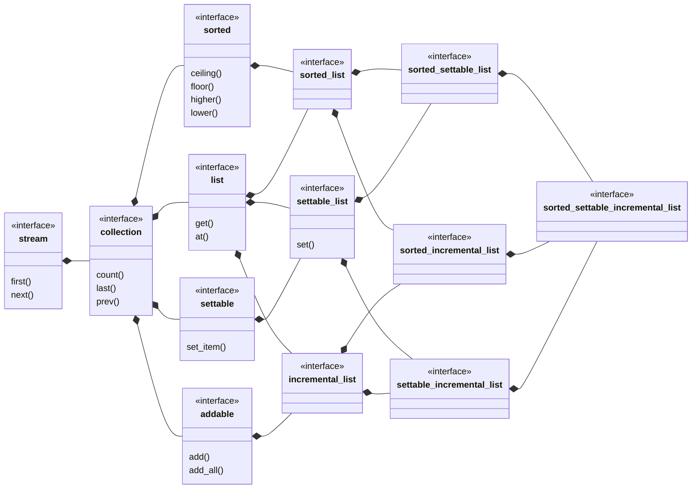

## sorted_settable_incremental_list

[sorted_settable_incremental_list](sorted_settable_incremental_list.md) _is a_ 
[settable_incremental_list](settable_incremental_list.md) where the items are 
sorted.
