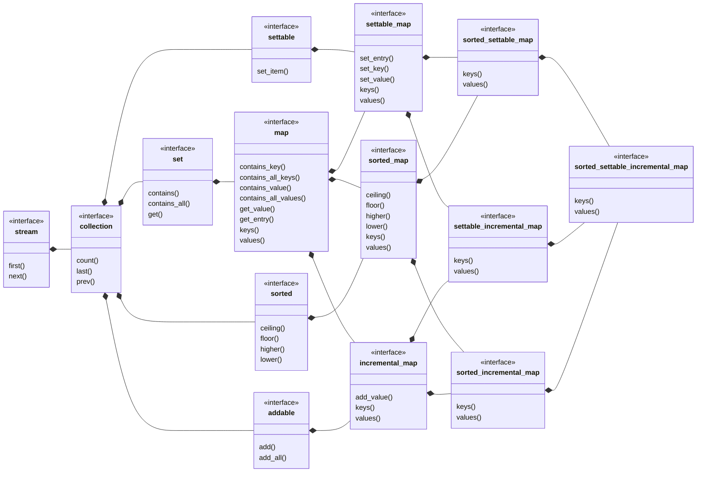

## sorted_settable_incremental_map

[sorted_settable_incremental_map](sorted_settable_incremental_map.md) _is a_ 
[settable_incremental_map](settable_incremental_map.md)
where the keys are sorted.
- [sorted_settable_incremental_set](sorted_settable_incremental_set.md) view of 
  keys
- [ordered_settable_list](ordered_settable_list.md) view of values

