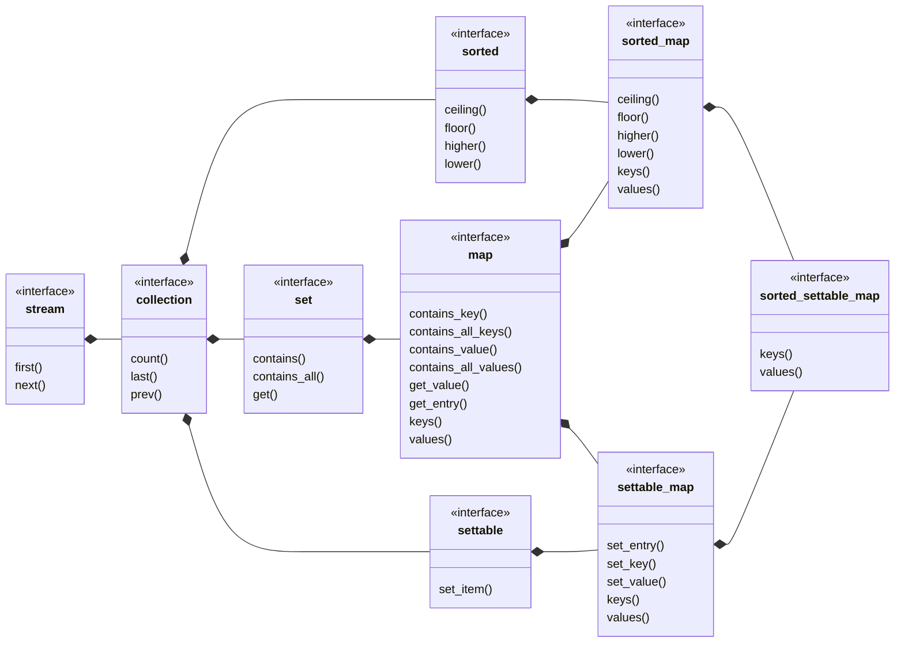

## sorted_settable_map

[sorted_settable_map](sorted_settable_map.md) _is a_ [settable_map](settable_map.md) where the keys are sorted.
- [sorted_settable_set](sorted_settable_set.md) view of keys
- [ordered_settable_list](ordered_settable_list.md) view of values
