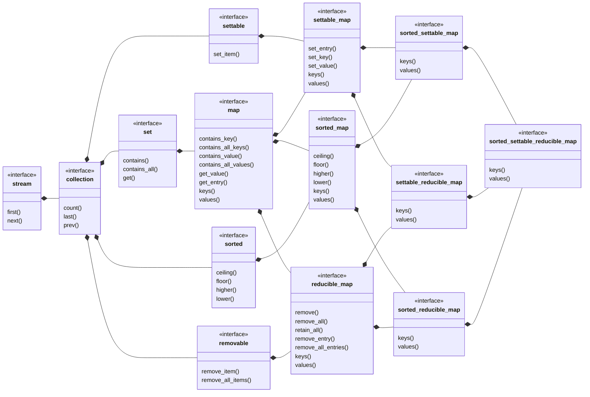

## sorted_settable_reducible_map

[sorted_settable_reducible_map](sorted_settable_reducible_map.md) _is a_ 
[settable_reducible_map](settable_reducible_map.md) where the keys are sorted.
- [sorted_settable_reducible_set](sorted_settable_reducible_set.md) view of keys
- [ordered_settable_reducible_list](ordered_settable_reducible_list.md) view of values
