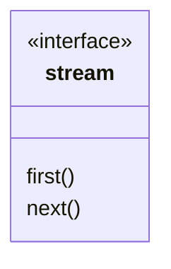

## stream

```mermaid
classDiagram
    direction LR
    class stream {
        first()
        next()
    }
    <<interface>> stream
```

[stream](stream.md) supply, a possible infinite, series of items.
- get first item.
- get next item from the given item.

