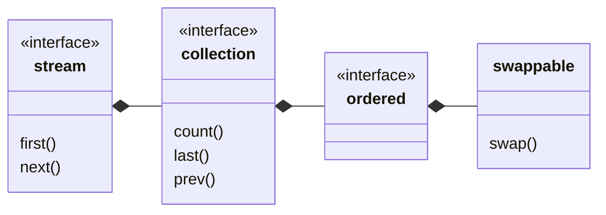

## swappable

```mermaid
classDiagram
    direction LR
    class stream {
        first()
        next()
    }
    <<interface>> stream
    class collection {
        count()
        last()
        prev()
    }
    <<interface>> collection
    stream *-- collection
    class ordered 
    <<interface>> ordered
    collection *-- ordered
    class swappable {
        swap()
    }
    ordered *-- swappable
```

[swappable](swappable.md) _is an_ [ordered](ordered.md) that allows the 
swapping of items.
- swap
