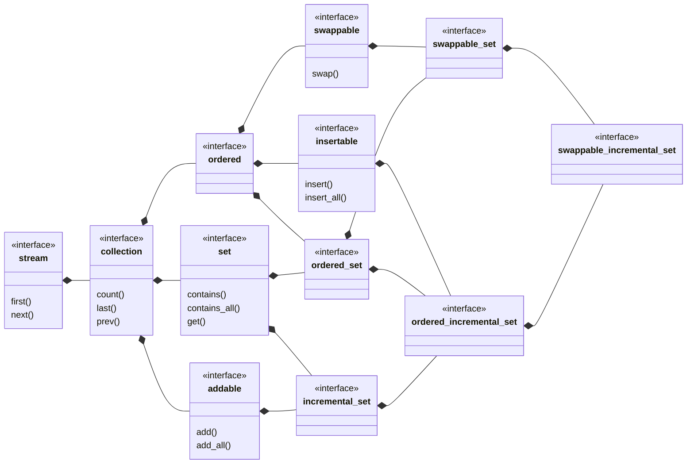

## swappable_incremental_set

```mermaid
classDiagram
    direction LR
    class stream {
        first()
        next()
    }
    <<interface>> stream
    class collection {
        count()
        last()
        prev()
    }
    <<interface>> collection
    stream *-- collection
    class ordered
    <<interface>> ordered
    collection *-- ordered
    class insertable {
        insert()
        insert_all()
    }
    <<interface>> insertable
    ordered *-- insertable
    class swappable {
        swap()
    }
    <<interface>> swappable
    ordered *-- swappable
    class set {
        contains()
        contains_all()
        get()
    }
    <<interface>> set
    collection *-- set
    class addable {
        add()
        add_all()
    }
    <<interface>> addable
    collection *-- addable
    class incremental_set 
    <<interface>> incremental_set
    set *-- incremental_set
    addable *-- incremental_set
    class ordered_set
    <<interface>> ordered_set
    ordered *-- ordered_set
    set *-- ordered_set
    class swappable_set
    <<interface>> swappable_set
    swappable *-- swappable_set
    ordered_set *-- swappable_set
    class ordered_incremental_set
    <<interface>> ordered_incremental_set
    insertable *-- ordered_incremental_set
    ordered_set *-- ordered_incremental_set
    incremental_set *-- ordered_incremental_set
    class swappable_incremental_set
    <<interface>> swappable_incremental_set
    swappable_set *-- swappable_incremental_set
    ordered_incremental_set *-- swappable_incremental_set
```

[swappable_incremental_set](swappable_incremental_set.md) _is an_ [ordered_incremental_set](ordered_incremental_set.md) 
that allows the swapping of items.
