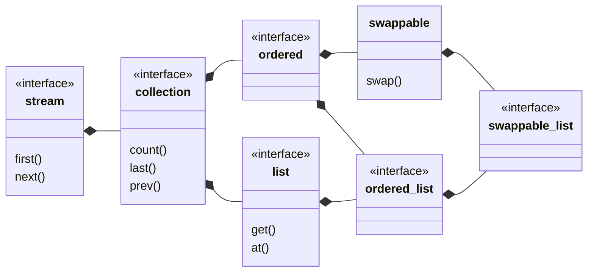

## swappable

```mermaid
classDiagram
    direction LR
    class stream {
        first()
        next()
    }
    <<interface>> stream
    class collection {
        count()
        last()
        prev()
    }
    <<interface>> collection
    stream *-- collection
    class ordered 
    <<interface>> ordered
    collection *-- ordered
    class swappable {
        swap()
    }
    ordered *-- swappable
    class list {
        get()
        at()
    }
    <<interface>> list
    collection *-- list
    class ordered_list
    <<interface>> ordered_list
    ordered *-- ordered_list
    list *-- ordered_list
    class swappable_list
    <<interface>> swappable_list
    swappable *-- swappable_list
    ordered_list *-- swappable_list
```

[swappable_list](swappable_list.md) _is an_ [ordered_list](ordered_list.md) 
where the items are swappable.
