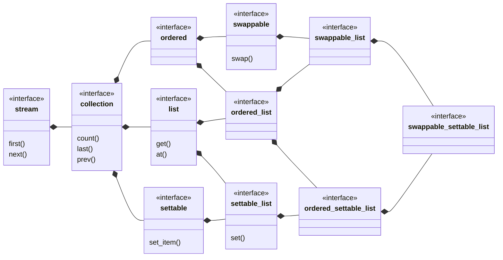

## swappable_settable_list

```mermaid
classDiagram
    direction LR
    class stream {
        first()
        next()
    }
    <<interface>> stream
    class collection {
        count()
        last()
        prev()
    }
    <<interface>> collection
    stream *-- collection
    class ordered
    <<interface>> ordered
    collection *-- ordered
    class swappable {
        swap()
    }
    <<interface>> swappable
    ordered *-- swappable
    class settable {
        set_item()
    }
    <<interface>> settable
    collection *-- settable
    class list {
        get()
        at()
    }
    <<interface>> list
    collection *-- list
    class settable_list {
        set()
    }
    <<interface>> settable_list
    list *-- settable_list
    settable *-- settable_list
    class ordered_list
    <<interface>> ordered_list
    ordered *-- ordered_list
    list *-- ordered_list
    class ordered_settable_list 
    <<interface>> ordered_settable_list
    ordered_list *-- ordered_settable_list
    settable_list *-- ordered_settable_list
    class swappable_list
    <<interface>> swappable_list
    swappable *-- swappable_list
    ordered_list *-- swappable_list
    class swappable_settable_list
    <<interface>> swappable_settable_list
    swappable_list *-- swappable_settable_list
    ordered_settable_list *-- swappable_settable_list
```

[swappable_settable_list](swappable_settable_set.md) _is an_ 
[ordered_settable_set](ordered_settable_set.md) where the items may be swapped.
