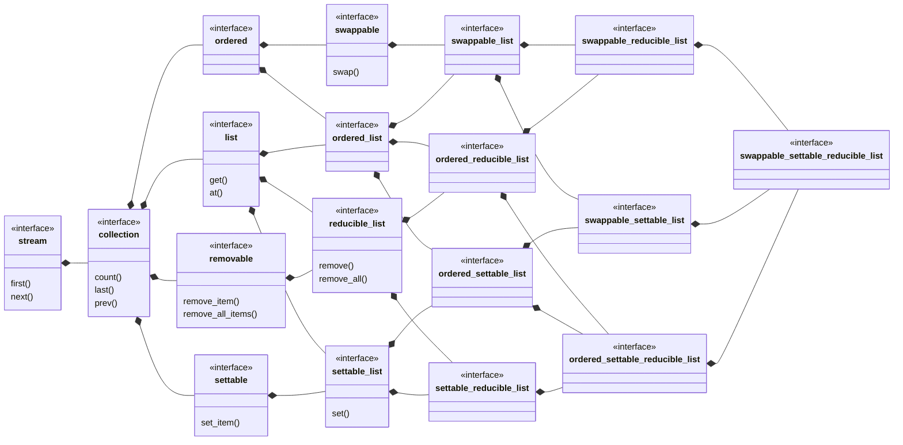

## swappable_settable_reducible_list

[swappable_settable_reducible_list](swappable_settable_reducible_list.md) _is an_
[ordered_settable_reducible_list](ordered_settable_reducible_list.md) where the items may be swapped.
