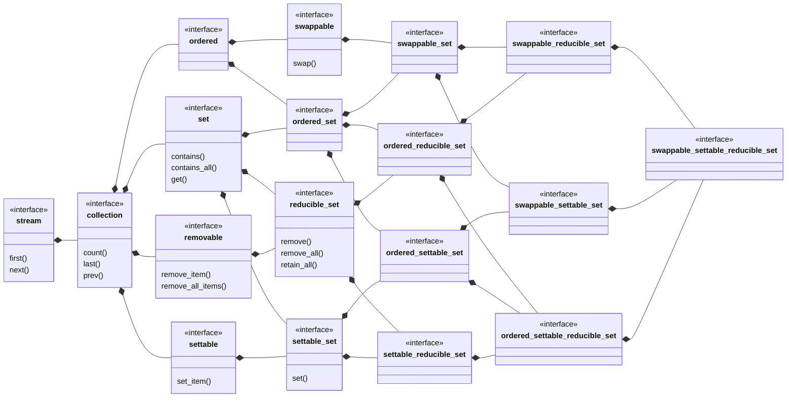

## swappable_settable_reducible_set

[swappable_settable_reducible_set](swappable_settable_reducible_set.md) _is an_
[ordered_settable_reducible_set](ordered_settable_reducible_set.md) where the items may be swapped.
