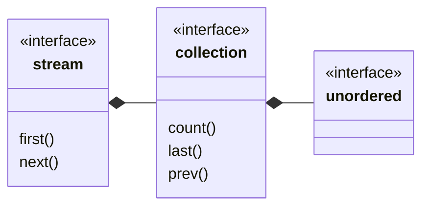

## unordered

```mermaid
classDiagram
    direction LR
    class stream {
        first()
        next()
    }
    <<interface>> stream
    class collection {
        count()
        last()
        prev()
    }
    <<interface>> collection
    stream *-- collection
    class unordered 
    <<interface>> unordered
    collection *-- unordered
```

[unordered](unordered.md) is a [collection](collection.md) where item order is 
not significant.
